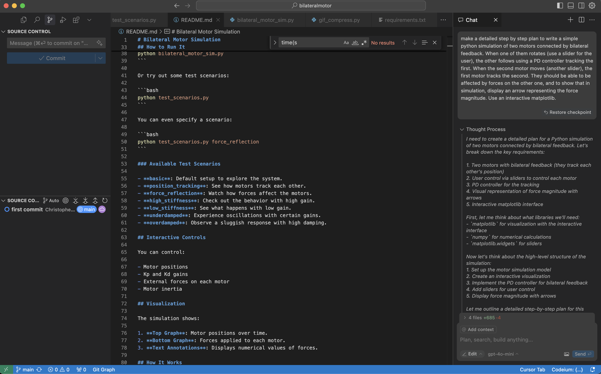
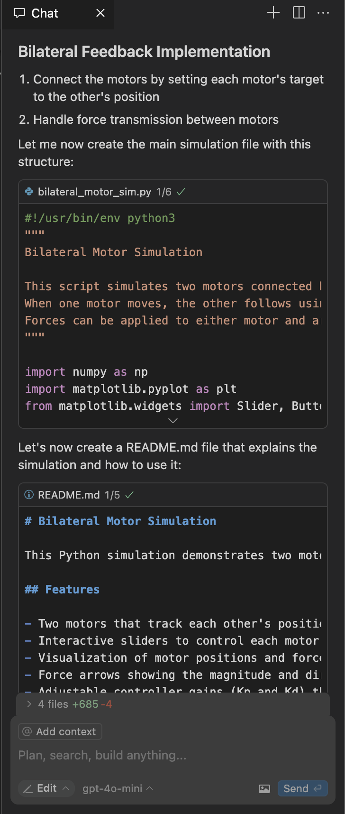
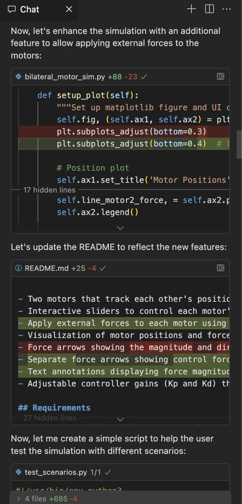
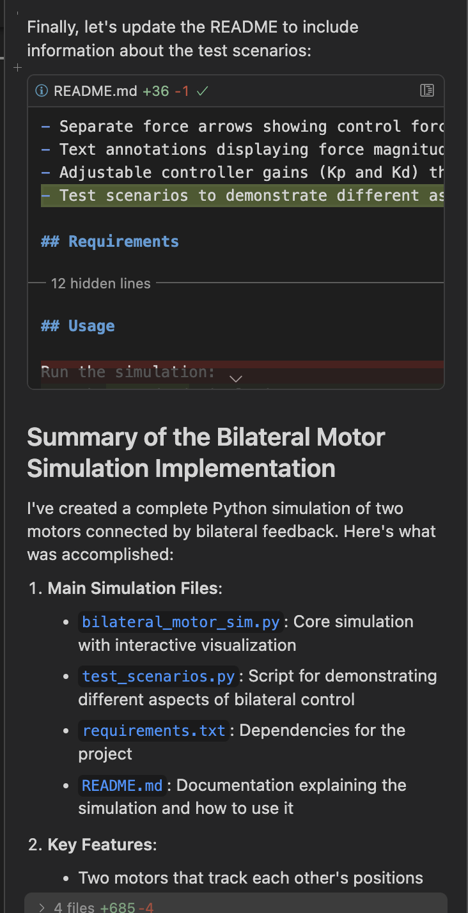

# Bilateral Motor Simulation

**Disclaimer**: Most of this project was generated by AI

This Python program simulates two motors connected by bilateral feedback. It shows how they track each other's positions and respond to forces, often used for teleoperation.


## What It Does

- Two motors that follow each other's positions using PD controllers.
- Interactive sliders to control each motor's position.
- Apply external forces to each motor with sliders.
- Visualize motor positions and forces over time.
- Adjustable controller gains (Kp and Kd) through sliders.
- Test scenarios to see different aspects of bilateral control.

## Requirements

- Python 3.6+
- NumPy
- Matplotlib

## Getting Started

1. Clone this repo or download the files.
2. Install the dependencies:

   ```bash
   pip install -r requirements.txt
   ```

## How to Run It

Just run the standard simulation:

```bash
python bilateral_motor_sim.py
```

Or try out some test scenarios:

```bash
python test_scenarios.py
```

You can even specify a scenario:

```bash
python test_scenarios.py force_reflection
```

### Available Test Scenarios

- **basic**: Default setup to explore the system.
- **position_tracking**: See how motors track each other.
- **force_reflection**: Watch how forces affect the motors.
- **high_stiffness**: Check out the behavior with high gain.
- **low_stiffness**: See what happens with low gain.
- **underdamped**: Experience oscillations with certain gains.
- **overdamped**: Observe a sluggish response with high damping.

## Interactive Controls

You can control:

- Motor positions
- Kp and Kd gains
- External forces on each motor
- Motor inertia

## Visualization

The simulation shows:

1. **Top Graph**: Motor positions over time.
2. **Bottom Graph**: Forces applied to each motor.
3. **Text Annotations**: Displays numerical values of forces.

## How It Works

Each motor is modeled with position, velocity, inertia, control input, and external force. The dynamics are governed by:

### Motor Dynamics

Each motor is modeled with:
- Position (θ)
- Velocity (ω)
- Inertia (J)
- Control input (τ)
- External force (F)

The motor dynamics are governed by:
```
J * d²θ/dt² = τ + F
```

Where:
- J is the motor inertia.
- τ is the control torque.
- F is the external force.

### PD Control Implementation

The PD controller calculates the control force based on position and velocity errors:

```
Control Force = Kp * (target_position - current_position) + Kd * (target_velocity - current_velocity)
```

Where:
- Kp is the proportional gain (controls stiffness)
- Kd is the derivative gain (controls damping)
- target_position is the desired position (from the other motor)
- target_velocity is the desired velocity (from the other motor)

The total force applied to each motor is:
```
Total Force = Control Force + External Force
```

### Bilateral Feedback

The motors are connected through bilateral feedback where:
1. Each motor's target position is set to the other motor's current position
2. Each motor's target velocity is set to the other motor's current velocity
3. The PD controller generates forces to minimize position and velocity errors

When a slider is active:
- The controlled motor's target position is set to the slider value
- The other motor follows the controlled motor through bilateral feedback

### Simulation Parameters

- Time step (dt): 0.01 seconds
- Default gains: Kp = 100.0, Kd = 1.0
- Default motor inertias: Motor 1 = 0.20, Motor 2 = 0.05
- Adjustable inertias: 0.01 to 1.0 for each motor
- Position range: -π to π radians
- Force range: -10 to 10 units

## Bilateral Control Dynamics

The bilateral control system demonstrates several important characteristics:

1. **Synchronization**: The motors will attempt to synchronize their positions
2. **Force Reflection**: Forces applied to one motor are reflected to the other through the control system
3. **Stability**: The PD controller parameters affect the stability and response of the system
4. **Disturbance Rejection**: The system will attempt to reject external forces to maintain synchronization

## Applications

Bilateral control systems are used in various applications:

1. **Teleoperation**: Remote control of robots with force feedback
2. **Haptic Interfaces**: Virtual reality controllers that provide force feedback
3. **Surgical Robots**: Providing surgeons with force feedback during remote procedures
4. **Training Simulators**: Creating realistic force feedback in training environments
5. **Cooperative Robots**: Multiple robots working together to manipulate objects

## Why It's Cool

This project demonstrates how bilateral control systems work, which are used in teleoperation, haptic interfaces, surgical robots, and more. It's a great way to learn about control systems and motor dynamics!

## Experimentation Tips

- **Tuning Gains**: Play around with Kp and Kd to see how they affect stability and response.
- **Force Reflection**: Apply forces to one motor and see how the other reacts.
- **Inertia Effects**: Adjust inertia to observe different behaviors.

## How this was made

This project was made by a team of AI agents using [Cursor Agents](https://www.cursor.com/agents) and [Claude 3.5 and 3.7 Sonnet](https://www.anthropic.com/claude).




<div style="display: flex; justify-content: space-around;">
    
    
    
</div>
